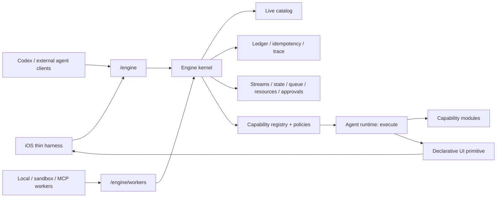

# Tron Modular Engine Audit

Last verified: 2026-05-18.
Baseline inspected before this document: `next/modular-capability-engine` at
`25c16d6b8` plus the current working tree.

This audit is a source-grounded map of what Tron currently contains and how it
should be simplified if Tron stops being the main mobile-first agent chat
manager and becomes a modular local capability engine with a thin chat and UI
test harness.

The strategic default is:

- Codex can own the primary remote coding chat use case.
- Tron should double down on the local/private modular engine, local model
  paths, dynamic capability registration, execution policy, audit, and
  generated native UI experiments.
- The iOS app should remain only where it helps test and operate that modular
  engine. Existing stable mobile session-manager behavior is not a preservation
  constraint.

## Evidence Base

The audit is grounded in these current source surfaces:

- `packages/agent/src/lib.rs` and `packages/agent/src/*/mod.rs` for the Rust
  module boundaries.
- `packages/agent/src/domains/*/contract.rs` for canonical function ids and
  capability families.
- `packages/agent/src/engine/*` and `packages/agent/src/engine/primitives/*`
  for the engine kernel.
- `packages/ios-app/docs/architecture.md`,
  `packages/ios-app/docs/capability-ui.md`, and current iOS source directories
  for the app surface.
- `README.md` for the public architecture promise and maintenance contract.

Static inventory from the current tree:

- Rust agent source files: 622 under `domains`, 33 under `shared`, 34 under
  `engine`, 23 under `transport`, 11 under `platform`, and 8 under `app`.
- First-party domain capability contracts: 190 `CapabilityContract::new(...)`
  registrations across 32 namespace families.
- Engine primitive functions: approximately 39 across approval, catalog,
  observability, queue, resource, state, storage, stream, and worker
  primitives.
- iOS source files: 198 under `Views`, 102 under `Core`, 78 under `Services`,
  68 under `ViewModels`, 52 under `Models`, and 14 under `Database`.
- iOS view groups still include fixed product surfaces for chat, Engine
  Console, automations, voice notes, source changes, settings, onboarding,
  notifications, prompt library, subagents, and agent control.

External protocol references:

- A2UI is useful as a declarative UI reference: agents stream JSON UI
  descriptions, clients render native components, and the protocol separates UI
  structure from data and rendering.
- AG-UI is useful as an interaction/event reference: it frames streaming chat,
  shared state, user interrupts, tool rendering, and frontend/backend event
  flow.
- This audit does not recommend adopting either protocol wholesale yet. Tron
  should design the smallest native UI primitive that fits its engine, then
  keep an adapter path open.

References:

- https://a2ui.org/introduction/what-is-a2ui/
- https://a2ui.org/specification/v0.9-a2ui/
- https://docs.ag-ui.com/introduction

## Current Rust Server Map

The Rust server is already much closer to the desired modular engine than the
iOS app is. The main issue is not that the engine is absent; it is that product
features, fixed chat/session assumptions, and many first-party capability
families are still tightly present in the same runtime and client expectations.

| Layer | Current role | Future disposition |
| --- | --- | --- |
| `app` | HTTP shell, config, disk setup, health, metrics, onboarding, shutdown. | Keep minimal. It should only boot the engine, expose health/metrics, and own process lifecycle. |
| `transport` | `/engine` and `/engine/workers` WebSocket framing, auth gate, stream subscribe/poll/ack, protocol contracts. | Keep and harden. This is the public client/worker boundary, not a product API. |
| `engine` | Live catalog, invocation, schema validation, ledger, idempotency, streams, queues, state, typed resources, approvals, leases, compensation, workers, policy, external worker protocol. | Core engine kernel. This is the main asset. Split only when boundaries become clearer; do not remove. |
| `domains` | Worker-owned first-party capabilities and runtime services. Each domain owns contracts, deps, handlers, operations, tests, and stream publishers. | Reclassify into kernel-adjacent runtime, reusable modules, and removable product shell. |
| `platform` | APNS, device broker, updater, OS/vendor integrations. | Demote to optional product integration modules. Keep only what supports current experiments. |
| `shared` | Foundation IDs/errors/paths, protocol DTOs, storage/runtime context, cross-cutting helpers. | Keep, but trim as domains are removed. Avoid letting `shared` become a new product layer. |

### Engine Kernel

This is the part to protect and make cleaner.

Keep as the durable foundation:

- Live catalog and worker ownership: `LiveCatalog`, `WorkerDefinition`,
  `FunctionDefinition`, function/trigger revisions, visibility and health.
- Invocation path: `Invocation`, `InvocationRecord`, causal context, trace,
  authority grants, parent/root invocation identity.
- Schema and policy gates: request/response schemas, authority requirement,
  effect/risk, approval metadata, leases, compensation, idempotency.
- Primitive workers:
  - `approval::*`: request, resolve, get, list.
  - `catalog::*`: list, inspect, watch snapshot.
  - `grant::*`: derive, inspect, list, revoke engine-owned authority grants.
  - `observability::*`: trace, span, log, metric reads.
  - `queue::*`: enqueue, claim, complete, fail, cancel, get, list.
  - `resource::*`: register type, create, update, link, inspect, list.
  - `artifact::*`, `goal::*`, `claim::*`, `evidence::*`, `decision::*`:
    thin wrappers over the generic resource kernel.
  - `state::*`: get, set, delete, compare-and-set, list.
  - `storage::*`: stats, checkpoint, export snapshot, retention run.
  - `stream::*`: subscribe, poll, unsubscribe, publish.
  - `worker::*`: list, get, disconnect, health, protocol guide.
- `/engine/workers`: local worker connection, scoped worker identity with
  grant id/revision/hash and resource selectors, registration mode, heartbeat,
  durable/volatile health, stream publication through the engine.

Kernel risks to preserve during simplification:

- Mutating calls must keep explicit idempotency.
- High-risk autonomous calls must stay approval-gated.
- Worker promotion must remain explicit and audited.
- Stream visibility must remain server-side.
- The ledger must keep enough causality to explain every action after UI and
  product layers are deleted.

### Core Agent Runtime

These pieces are necessary for a modular agent engine but should be slimmed and
made less product-shaped.

| Family | Current function | Disposition |
| --- | --- | --- |
| `capability` | Model-facing `execute` orchestrator; operator search/inspect; registry snapshot; plugin/binding/policy/audit/admin functions; vector-backed search and primer rendering. | Keep and sharpen. This is the agent's gateway into the live catalog. Admin surfaces should become operator capabilities, not fixed app pages. |
| `program` | `program::run_javascript`, QuickJS sidecar process, bounded execute-only `tools.execute` composition. | Keep. This is a strong modular-composition primitive and should become a canonical way to build higher-order workflows. |
| `model` and `config` | Provider catalog/list/switch and reasoning level. Providers include Anthropic, OpenAI, Google, MiniMax, Kimi, and Ollama. | Keep, but separate model-provider plumbing from chat-product assumptions. Local providers and profile policy are strategically important. |
| `auth` | Provider credentials, OAuth/API keys, account selection, bearer token. | Keep minimal. It is infrastructure, not a UX feature. iOS auth pages can be rebuilt generically from capability/UI metadata. |
| `settings` | Server-authoritative profile/user overlay reads and sparse updates. | Keep, but move toward profile/runtime policy as data. Do not require every setting to have bespoke iOS UI if generated UI becomes the settings surface. |
| `agent` | Prompt, abort, prompt queue, turn running, ask-user pause, subagents, hidden apply/run-turn functions. | Rebuild. Keep prompt execution as an engine worker, but remove assumptions that Tron is the central chat/session manager. User interaction, subagents, and queueing should be generic lifecycle primitives. |
| `session` | Create/resume/list/delete/fork/reconstruct/archive/export over event-sourced session state. | Rebuild as a thin experimental conversation/event log, not a mobile-first session product. Keep reconstruction only if it remains the simplest way to test engine output. |
| `events`, `message`, `tree`, `blob` | Event reads/subscriptions/append, message delete, tree visualization, blob reads. | Consolidate. Preserve durable event and blob mechanics, but remove separate product-shaped read APIs once streams/storage/session reconstruction cover the harness. |
| `system`, `logs` | Ping/info/diagnostics/shutdown/update reads and log ingest/recent. | Keep a small diagnostic/control surface. Move update/product support out of the engine core if release distribution is de-emphasized. |

### Capability Modules

These should survive only as modular workers with clear contracts. They should
not force bespoke iOS screens or product navigation.

| Family | Current capability count | Current purpose | Future disposition |
| --- | ---: | --- | --- |
| `filesystem` | 11 | List/read/write/edit/find/glob/search/diff/apply patch. | Keep as a first-party core capability module. |
| `process` | 1 | Bounded shell execution with classifier, output caps, policy, approval, and stream topics. | Keep. It is essential for local agent work. Keep approval classifier small and auditable. |
| `web` | 2 | Fetch and search. | Keep as optional network capability; policy should make external network use explicit. |
| `mcp` | 8 | Plugin source server lifecycle and capability listing. | Keep as a plugin-ingress capability module. Rework UI around registry metadata. |
| `sandbox` | 4 | Spawn/list/get/stop local sandbox-created workers. | Keep. This is central to modular capability creation. Do not reintroduce the deleted Sandboxes dashboard. |
| `skills` | 6 | Skill registry, activation, refresh. | Rebuild as context/capability metadata provider. Keep if skills remain useful to local model workflows. |
| `context` | 9 | Snapshot, audit, compaction, clear, should/can accept turn. | Rebuild as context provider and compaction capability, not as a chat UI feature. |
| `memory` | 2 | Auto-retain and retain. | Defer or demote. Memory should become a capability/context module after core modularity is clean. |
| `cron` | 8 | Scheduled jobs and run history. | Demote to optional automation module. Useful later, but not core to the first-principles engine. |
| `job` | 7 | Background jobs, waiting, streaming output, subscription. | Rebuild into queue/run lifecycle primitives where possible. Avoid a parallel job abstraction unless it adds value beyond engine queues and streams. |
| `git`, `worktree`, `repo` | 30 total | Clone, sync, push, worktree acquire/release/status/diff/merge/rebase/conflict flows, repo sibling session queries. | Demote to optional source-control module. Keep process/filesystem as the generic substrate; re-add workflow UI through generated forms if needed. |
| `import` | 4 | Discover/preview/execute external session imports. | Remove or defer unless import becomes a generic adapter capability. |
| `browser`, `display` | 2 total | Browser/computer-use status and display stream stop. | Defer. Keep only if near-term generated UI or visual-capability experiments need them. |
| `notifications`, `device` | 7 total | Local/APNS notification send, inbox/read state, device tokens and responses. | Demote. Keep `notifications::send` only if it remains a generic low-risk user notification capability. Device/APNS is product shell. |
| `transcription`, `voice_notes` | 6 total | Audio transcription and voice note CRUD. | Remove from core; re-add as optional media workers later. |
| `prompt_library` | 9 | Prompt history and snippets. | Remove or demote. It is a chat-product feature, not engine essence. |
| `plan` | 3 | Enter/exit/get plan state. | Remove or redesign as generic agent lifecycle state only if needed. |

## Current iOS App Map

The iOS app is still the largest product shell. It is valuable as a native
testbed, but much of it encodes the old goal: a polished mobile session manager
for Tron as the central agent.

### Source Shape

Current Swift source distribution:

| Area | Swift files | Meaning |
| --- | ---: | --- |
| `Views` | 198 | Most product UI lives here: chat, settings, source control, voice notes, automations, onboarding, etc. |
| `Core` | 102 | Event plugins, transformers, payload types, repositories, DI helpers. |
| `Services` | 78 | Engine/WebSocket clients, local storage, diagnostics, settings, notification, onboarding, audio. |
| `ViewModels` | 68 | Chat state, Engine Console state, settings state, coordinator state. |
| `Models` | 52 | Engine protocol DTOs, messages, events, features, share/tokens. |
| `Database` | 14 | Local SQLite event/session cache. |

Current `Views` groups:

| Surface | Swift files | Audit disposition |
| --- | ---: | --- |
| `Chat` | 11 | Keep but rebuild as a thin engine harness. Chat should display text, capability events, approvals, and generated UI surfaces, not own product workflows. |
| `InputBar`, `MessageBubble`, `Capabilities`, `EngineApproval`, `UserInteraction`, `Subagents` | 30 total | Keep the generic parts. These are closest to reusable engine rendering. Collapse bespoke cases into lifecycle/capability renderers. |
| `EngineConsole` | 1 | Keep as an operator lab, but make it more generic and generated from capability/admin metadata. |
| `AgentControl` | 17 | Remove or rebuild. It is mostly fixed session/control UX. Extract reusable context/capability renderers only. |
| `SourceChanges` | 14 | Remove fixed source-control sheets. Reintroduce through generated forms/action cards if source-control capabilities remain. |
| `Automations` | 5 | Demote with `cron`. Useful later, not core. |
| `VoiceNotes` | 5 | Remove from core; optional media module later. |
| `PromptLibrary` | 7 | Remove or demote with prompt history/snippets. |
| `Settings` | 5 | Rebuild. Keep server selection/auth/profile controls only until generated settings UI exists. |
| `Onboarding` | 3 | Trim to local pairing/connection only if iOS remains a harness. Mac/TestFlight onboarding is product distribution shell. |
| `Notifications` | 3 | Demote unless approvals/async status require a small notification inbox. |
| `Session` | 7 | Rebuild around minimal harness session creation and local model/profile choice. Remove import/clone/workspace-first assumptions. |
| `Attachments`, `Browser`, `Process`, `Skills`, `System`, `Components` | mixed | Keep only generic widgets that support chat, generated UI, capability details, and diagnostics. |

### iOS Dependency Paths

| Path | Current role | Future disposition |
| --- | --- | --- |
| `Services/Network/EngineClient.swift` and `Clients/*` | A typed Swift client for every server domain family. | Rebuild as a small generic engine client plus optional typed adapters for core primitives. Avoid adding a Swift client for every capability module. |
| `Models/EngineProtocol/*` | `/engine` frames, invocation, stream, settings, capability, cron, auth, event DTOs. | Keep core protocol DTOs. Move feature DTOs behind generated schemas or module packages. |
| `Core/Events/Plugins/*` | Per-event parsing and dispatch into chat/dashboard state. | Rebuild around generic lifecycle, capability, generated UI, approval, and stream events. Delete product-specific plugins as matching server events go away. |
| `Core/Events/Transformer/*` | Stored event reconstruction into `ChatMessage`. | Keep only if the harness keeps server-reconstructed history. Prefer server-authoritative reconstruction plus thin local cache. |
| `Database/*` | Local SQLite cache for sessions, events, drafts, thinking, tree. | Reassess. It is product-heavy. A thin harness can use small local drafts/cache and rely on server streams/history for truth. |
| `ViewModels/Chat/*` | Session-scoped connection, reconstruction, messaging, event handling, capabilities, transcription, repo actions. | Rebuild as one minimal view model over engine streams and generated UI surfaces. |
| `ViewModels/State/EngineConsoleState.swift` | Capability status/search/inspect/audit/program runs and disconnected cache. | Keep as prototype for operator state, but reduce fixed sections and let capability metadata drive more UI. |

## Essentiality Matrix

| Status | Keep now | Rebuild | Demote/defer | Remove candidate |
| --- | --- | --- | --- | --- |
| Engine kernel | `engine`, `/engine`, `/engine/workers`, catalog, ledger, schema, policy, streams, queues, state, resources, approvals, leases, compensation, workers, storage, observability. | Split into crates/modules only after APIs stabilize. | None. | None. |
| Agent runtime | `capability`, `program`, provider model plumbing, auth/settings basics. | `agent`, `session`, event reconstruction, context assembly. | Prompt queue, subagent UX, prompt library. | Product-shaped message/tree APIs after replacement. |
| Capability modules | filesystem, process, web, MCP/plugin sources, sandbox workers. | skills/context/memory as context providers; jobs as queue/run lifecycle. | git/worktree/repo, cron, notifications. | import, voice notes, transcription, fixed plan state unless rejustified. |
| iOS harness | Engine connection, minimal chat, capability/approval/lifecycle rendering, Engine Console prototype. | Chat view model, event plugins, local database, settings/onboarding, generated UI renderer. | automations, notification inbox, source-control views, voice UI. | AgentControl, PromptLibrary, fixed SourceChanges, most bespoke feature sheets. |
| Distribution shell | Local dev scripts and Mac app pieces needed to run the daemon. | Mac/iOS onboarding if product direction changes. | TestFlight public beta flow, APNS relay, updater UI. | Anything that exists only to preserve the old mobile-first product. |

## Target Architecture

The target should be "Tron as modular capability engine plus thin chat/UI
harness":

The implementation target has since been collapsed further in
[`docs/collapsed-modular-engine-architecture.md`](collapsed-modular-engine-architecture.md):
workers invoke capabilities against typed resources under scoped grants.
Artifacts, goals, claims, evidence, decisions, generated UI surfaces, module
config, worker packages, secret refs, and materialized files are resource kinds
rather than separate persistence planes.

Target properties:

- The engine kernel is independent of the iOS product shell.
- Every executable unit is a canonical `namespace::function` owned by one
  worker.
- Agent-facing behavior goes through one model-visible `capability::execute`
  primitive. Search and inspect remain operator/internal catalog views.
- Product-specific workflows become optional worker packages or generated UI
  surfaces, not hardcoded client navigation.
- Chat exists to test model turns, capability calls, approvals, streaming, and
  generated UI.
- The iOS client renders server-owned state and declarative UI safely; it does
  not invent routing, binding, policy, or local capability catalogs.

## Generated Native UI Primitive

Dynamic/native UI should become a first-class engine capability area.

The minimum useful primitive is not "A2UI support"; it is a Tron-native UI
contract with optional reference adapters:

| Primitive | Responsibility |
| --- | --- |
| UI stream topic | Server emits UI surface events through engine streams with trace/session/workspace scope. |
| Surface identity | Stable `surfaceId`, owner invocation, lifecycle status, visibility, and expiry. |
| Component catalog | iOS advertises supported native components and constraints. Server/agent chooses only from that catalog. |
| Declarative tree | JSON component graph with IDs, bindings, layout hints, validation, and accessibility labels. |
| Data model | Server-owned or shared state model with explicit update events. |
| Action callback | Button/form/list actions return through `/engine` as audited invocations or action events. |
| Validation | Server validates schema and allowed component/action set before emitting. Client validates again before rendering. |
| Audit | UI creation, updates, user actions, rejected actions, and generated payload hashes enter the ledger/streams. |

Useful A2UI ideas:

- Declarative data, not executable UI code.
- Native rendering by the client.
- Component catalog exchange.
- Streaming/progressive updates.
- Separation between UI structure, data model, and rendering.

Useful AG-UI ideas:

- Agent-user interaction as an event stream.
- Interrupts, approvals, shared state, tool rendering, frontend actions, and
  long-running work as protocol-level events.

Tron-specific constraint:

- Generated UI must not bypass capability policy. Any action generated by an
  agent must resolve back to a canonical engine function or an audited user
  response event.

## Removal And Rebuild Backlog

### Phase 0: Freeze The New Direction

- Keep this audit as the durable map.
- Update README links and future docs to state that Tron is pivoting toward a
  modular capability engine and thin harness.
- Avoid adding new fixed iOS feature dashboards unless they are explicitly
  prototypes for generated UI or reusable capability rendering.

Verification:

- `git diff --check`.
- README link sanity check.

### Phase 1: Define The Minimal Harness Contract

- Specify the small iOS harness: connect, choose/create minimal session,
  send prompt, show assistant text, capability lifecycle, approvals, generated
  UI surfaces, and operator Engine Console.
- Remove or hide fixed product surfaces from top-level navigation:
  AgentControl, SourceChanges, PromptLibrary, Automations, VoiceNotes,
  Notifications inbox, fixed source-control sheets.
- Replace typed feature clients in iOS with either the generic engine client or
  a very small set of core adapters.

Tests/docs:

- Update `packages/ios-app/docs/architecture.md`,
  `packages/ios-app/docs/capability-ui.md`, and README iOS sections.
- Remove/replace tests for deleted views and typed clients.
- Keep tests for engine connection, capability client, approval handling, and
  generic event rendering.

### Phase 2: Rebuild Chat Around Engine Events

- Collapse `ChatViewModel` extensions and product coordinators into a smaller
  engine-session harness model.
- Treat `session::reconstruct` as server truth if retained; delete local
  reconstruction paths that duplicate server behavior.
- Reduce local SQLite to drafts, connection cache, and optional stale console
  summaries, or remove it entirely if server streams/history are enough.
- Keep rendering generic: text, thinking summary, capability invocation/result,
  approval/user input, generated UI surface, error/status.

Tests/docs:

- New golden fixtures for the minimal event set.
- Delete product-specific reconstruction fixtures as server events are removed.
- Keep pagination only if real harness UX requires it.

### Phase 3: Separate Core Runtime From Optional Modules

- Keep `capability`, `program`, `model`, `auth`, `settings`, and a slim
  `agent/session` loop as the core runtime.
- Move or mark optional: git/worktree/repo, cron, notifications/device,
  transcription/voice_notes, prompt_library, import, plan, browser/display.
- Consolidate event/message/tree/blob surfaces around storage, stream, and
  session primitives.
- Make module install/enable/disable policy visible through the capability
  registry rather than bespoke settings screens.

Tests/docs:

- Rust registration tests should prove only intended default workers register
  in a minimal profile.
- Capability registry tests should prove optional modules appear/disappear
  cleanly and preserve schema/policy metadata.
- iOS tests should not assume optional module DTOs exist.

### Phase 4: Add The UI Primitive

- Add a `ui` domain or engine-adjacent primitive for declarative surfaces.
- Add iOS native renderer for the initial component catalog:
  text, markdown, card/section, button, form, text field, picker, toggle,
  list/table, status/progress, artifact preview, and capability action row.
- Add action round-trip through audited engine invocations.
- Add UI surface stream handling to chat and Engine Console.
- Optionally write A2UI/AG-UI adapter experiments after the Tron-native shape
  works.

Tests/docs:

- Server schema validation tests for accepted/rejected UI messages.
- iOS renderer tests for unsupported components, invalid bindings, action
  callback encoding, and explicit rejection of unsupported rendering paths.
- End-to-end harness test: model emits UI, iOS renders it, user taps action,
  server records audited action.

### Phase 5: Harden Modular Capability Development

- Make `worker::protocol_guide` and `worker::spawn` the primary path
  for generated workers.
- Add conformance suites for worker registration, schema metadata, approval,
  leases, compensation, streams, generated UI, and lifecycle records.
- Add a minimal package format for local capability modules.
- Add operator flows for candidate/healthy/promoted implementation state.

Tests/docs:

- Conformance fixtures for first-party and sandbox-created workers.
- Registry/audit tests for worker lifecycle and generated UI actions.
- Manual readiness checklist rewritten around modular worker creation and
  generated UI rendering.

## Open Risks

| Risk | Why it matters | Mitigation |
| --- | --- | --- |
| Data migration | Current SQLite stores sessions, events, engine ledger, capability registry, notifications, cron, prompt history, and device state together. Removing product surfaces can strand data. | Decide whether this branch allows a clean DB generation reset. If yes, cut aggressively. If no, add one migration/export path before removals. |
| Auth/profile compatibility | Auth and profile settings serve both engine runtime and old iOS settings pages. | Keep runtime auth/profile stable first; delete UI parity requirements only after generated settings or generic profile UI exists. |
| iOS settings parity tests | Current project requires server setting controls in iOS. Generated UI conflicts with hand-coded parity. | Replace parity with "settings are inspectable/editable through generated or generic schema UI" before deleting controls. |
| Local runtime DB assumptions | `self-inspect`, diagnostics, storage, and audit docs expect the unified DB shape. | Update self-inspect docs and tests whenever the runtime DB generation changes. |
| Generated UI safety | Agent-produced UI can mislead users or smuggle unsafe actions if actions are not canonical and audited. | Use declarative data only, client component allowlist, server and client validation, visible action provenance, and engine-ledger callbacks. |
| Scope creep through optional modules | Keeping every current feature as an optional module can recreate the old product. | Require each module to prove one reusable capability contract and generic UI rendering path before it returns. |
| Mac/iOS distribution inertia | TestFlight, APNS, updater, and onboarding flows can keep the old product alive by default. | Treat distribution shell as optional until the modular engine is valuable independently. |

## Immediate Decisions

1. The engine kernel stays.
2. The capability registry plus single model-facing execute path stays.
3. Program execution stays.
4. Sandbox-created workers stay.
5. iOS chat stays only as a modular engine harness.
6. Fixed iOS product dashboards are removal candidates.
7. Generated native UI becomes a target primitive.
8. A2UI and AG-UI are references, not dependencies.

## Practical Next Cut

The next implementation cut should not start by deleting random files. It
should first define the minimal harness contract and then delete every iOS
surface that is not required by that contract.

Recommended first patch series:

1. Add a `docs/minimal-harness-contract.md` that names the retained iOS
   surfaces and event types.
2. Remove fixed top-level product navigation for automations, voice notes, and
   source-control sheets.
3. Replace typed feature clients used only by those deleted views.
4. Keep Engine Console and chat capability rendering.
5. Start a `ui` primitive spike behind tests, with one generated form rendered
   in chat.
