# Agent Context Architecture Audit

This document maps the current working-tree architecture for everything that can
enter an agent turn's model context. It treats the profile-first Constitution
layout as the primary truth and names the source-of-truth files each subsystem
must resolve through.

## Executive Summary

Tron builds model context through a layered runtime path:

1. Startup initializes the profile-first Constitution home, compiles the active
   `ProfileRuntime`, initializes settings from that compiled spec, then starts
   the database, provider factory, capability registry, skill registry, memory
   registry, and orchestrator.
2. `agent::prompt` reconstructs session state, loads rules/memory/job results,
   refreshes skills, applies hook-injected context, and creates a per-run
   `TronAgent`.
3. `TronAgent::run` adds the current user message, enters the turn loop, and
   delegates each turn to `turn_runner`.
4. `turn_runner` asks `ContextManager` for the stable context, attaches
   per-turn volatile context from `RunContext`, records Constitution audit rows,
   asks the provider transport for its request payload, streams the response, and
   executes requested capability invocations.
5. Capability results and assistant messages are appended back into `ContextManager`
   and persisted to the event store, so the next turn sees the updated history.

The profile-first implementation makes the execution spec auditable: the
managed `profiles/default` base defines the full AgentExecutionSpec/manual,
managed `normal`, `chat`, and `local` child profiles select user-facing modes,
user settings stay sparse in `profiles/user`, all model input is recorded as
typed context blocks, and provider payloads are captured with redacted previews.

## Execution Path

```mermaid
flowchart TD
    Start["main.rs startup"] --> Home["ensure_tron_home / profile seed + managed default recovery"]
    Home --> ProfileRuntime["ProfileRuntime: compile active AgentExecutionSpec"]
    ProfileRuntime --> Settings["settings snapshot from resolved profile + user overlay + env overrides"]
    Settings --> Services["EventStore, Orchestrator, ProviderFactory, CapabilityRegistry, SkillRegistry, MemoryRegistry"]
    Services --> PromptCap["agent::prompt engine capability"]
    PromptCap --> Reconstruct["Session reconstruction from events"]
    Reconstruct --> Bootstrap["Prompt bootstrap: rules, rules index, pending jobs, process/subagent/user-job results"]
    Bootstrap --> Memory["MemoryRegistry: MEMORY.md + rules/*.md listing"]
    Memory --> AgentFactory["AgentFactory::create_agent"]
    AgentFactory --> ContextManager["ContextManager seeded with system prompt, rules, memory, messages, capability surface"]
    ContextManager --> UserMessage["TronAgent::run adds current user message"]
    UserMessage --> Turn["turn_runner::execute_turn"]
    Turn --> Compose["build_turn_context + compose_context_blocks"]
    Compose --> Audit["Constitution context + provider payload audit"]
    Audit --> Provider["Provider transport request"]
    Provider --> Stream["Stream processor + streaming journal"]
    Stream --> Capabilities["Capability invocation waves"]
    Capabilities --> Events["Persist assistant/capability/rules/events"]
    Events --> Next["Next turn context"]
    Capabilities --> Next
```

### Startup and Service Construction

`packages/agent/src/main.rs` is the root of the harness. The important context
steps are:

- `init_directories()` calls `core::constitution::ensure_tron_home()`, which
  creates the five durable roots, seeds managed profile defaults, repairs
  corrupt managed defaults, and validates the active profile before runtime
  services are used.
- `ProfileRuntime::load()` compiles the active profile into one
  `AgentExecutionSpec` snapshot. Session and process creation consume plans
  derived from this snapshot instead of resolving prompt/settings files at call
  sites. The profile watcher hashes profile TOML/Markdown files and swaps in a
  new snapshot only after strict validation succeeds.
- The database path resolves through the settings DB path policy, then SQLite
  migrations create or upgrade the event store, including the Constitution
  audit tables.
- `settings::init_settings()` receives the settings embedded in the compiled
  profile snapshot after sparse `profiles/user/profile.toml` settings and
  environment overrides have been applied.
- The agent turn runner builds provider-visible capabilities from the live engine
  catalog. Built-ins, MCP tools, and local worker functions enter the model
  surface only as canonical capabilities.
- `ServerRuntimeContext` is setup-only. Domain runtime paths receive narrowed
  deps, then invoke work through domain operations and engine primitives.

### Prompt Capability to Agent Construction

The prompt path is centered on
`packages/agent/src/domains/agent/runtime/service`.

- `agent::prompt` validates params, loads the session, records prompt history,
  starts a run, and spawns `execute_prompt_run`.
- `execute_prompt_run` reconstructs session messages from events. Chat sessions
  skip project artifacts and use the `chat` entrypoint prompt; normal sessions
  use the `main` entrypoint unless the provider is local.
- For cloud models, `load_prompt_bootstrap` gathers project/global rules,
  `RulesIndex`, pre-activated rules, and pending subagent/process/user-job
  notifications. Local models use a minimal bootstrap and leave pending results
  queued for later cloud-model turns.
- Memory is injected for non-local models from `~/.tron/memory/MEMORY.md` plus a
  listing of direct `~/.tron/memory/rules/*.md` files.
- If worktree isolation is active, the git worktree path, branch, and
  profile-backed `git-workflow` prompt are appended to memory content.
- System prompt precedence for normal non-local sessions is project
  `.tron/SYSTEM.md`, then global `~/.tron/profiles/user/prompts/core.md`, then
  the seeded default prompt loaded by `ContextManager`. Chat sessions directly
  use the seeded `chat` prompt. Local-provider sessions use the seeded `local`
  prompt regardless of chat/default source.
- `AgentFactory::create_agent` receives provider, capability surface, hooks,
  rules, memory, messages, rules index, and compaction settings, then builds a
  `ContextManager`.

### Skill, Hook, and Current User Prompt Injection

Before `TronAgent::run` starts:

- `SkillRegistry` refreshes so changed `SKILL.md` files are visible.
- `prepare_skill_context_from_session` reconstructs session-scoped skill state
  from events and can inject activation, active-skill XML, and one-turn removal
  notices. Under the AskUser compaction policy it can also append a
  `skills.cleared` event.
- The skill index is included according to `settings.skills.showIndex`: always,
  never, or only when no active skill content is present. Local models skip the
  skill index.
- `UserPromptSubmit` hooks can prepend `<hook-context>...</hook-context>` to the
  effective prompt. The hook-added context becomes part of the user message,
  not a separate Constitution context block.
- Multimodal user input can replace the text-only prompt with structured user
  content for images and attachments.

### Turn Runner and Provider Request

`packages/agent/src/domains/agent/runner/agent/turn_runner.rs` is the single-turn center of
gravity.

- `ContextManager::begin_turn()` advances the per-turn generation used to catch
  stale volatile token estimates.
- Compaction can run before the provider call. If compaction occurs, dynamic
  rules are cleared so path-sensitive context can be rebuilt.
- `build_turn_context` starts from `ContextManager::build_base_context`, attaches
  message history, capability schemas, server origin, skill contexts, job
  results, and dynamic rules from `RunContext`.
- Local providers use
  `packages/agent/src/domains/agent/runner/context/local_policy.rs` as a thin
  projection over the active AgentExecutionSpec: reduced capability schemas
  including `agent::ask_user`, no memory, no skill index, no job results,
  truncated rules, but explicit skill activation/active/removal context is
  retained.
- `compose_context_audit_blocks` compiles the provider-independent audit view.
  It includes prompt blocks plus audit-only hook context, capability schemas,
  and conversation messages.
- The provider transport also builds an exact or near-exact provider payload via
  `Provider::audit_payload`. Audit write failures currently fail the turn before
  the model call.
- The provider stream is processed into assistant deltas, thinking deltas,
  provider-native tool/function-call deltas at the provider boundary, token usage,
  and final stop reason. A streaming journal under
  `~/.tron/internal/database/journals/` is required for crash recovery.
- Capability invocation drafts are persisted before execution, executed in waves
  according to capability execution policy, then capability results are persisted
  and appended back into `ContextManager`.
- Touched paths can activate scoped rules, which are persisted as
  `rules.activated` and injected into later turns.

## Context Inventory

| Source | Current owner | Included when | Lifecycle | Surface | Cache class | Token accounting | Control knob |
| --- | --- | --- | --- | --- | --- | --- | --- |
| Seeded profile system prompts | `~/.tron/profiles/default/prompts/*.md` plus `normal`/`chat`/`local` entrypoint overrides; loaded by profile runtime and `ContextManager` | Always, unless project/global override provides the normal core prompt; chat maps main to `chat`; local maps main to `local` | Foundation/session | Provider instructions | Foundation | `systemPrompt` bucket | Edit child profile refs/prompts; project `.tron/SYSTEM.md` |
| Project system prompt override | `.tron/SYSTEM.md` in working directory | Normal non-chat sessions when present | Session | Provider instructions | Foundation | `systemPrompt` bucket | File contents |
| Global user profile prompt | `~/.tron/profiles/user/prompts/core.md` | Normal non-chat sessions when project override absent | Session | Provider instructions | Foundation | `systemPrompt` bucket | File contents |
| Project/global rules | `packages/agent/src/domains/agent/runner/context/` | Normal sessions; path-scoped rules can be pre-activated or dynamically activated | Session and turn | Provider instructions | Session/turn | `rules` and dynamic-rules buckets | `settings.context.rules.*`, rules files, touched paths |
| Memory root | `packages/agent/src/domains/agent/runner/memory/registry.rs`; `~/.tron/memory/MEMORY.md` | Non-local model turns | Session | Provider instructions | Session | `memory` bucket | memory capabilities and file contents |
| Memory detail listing | `~/.tron/memory/rules/*.md` listing only | Non-local model turns, as part of memory content | Session | Provider instructions | Session | `memory` bucket | File presence/frontmatter |
| Worktree isolation note | `agent_prompt_service.rs` plus `git-workflow` prompt | Sessions with acquired worktree | Session | Provider instructions through memory | Session | `memory` bucket | Worktree/session isolation settings |
| Capability primer | `capability::registry` snapshot rendered by `turn_runner` | Enabled by `capabilityPolicies.*.contextPrimerPolicy`; default is core first-party capabilities | Turn | Provider instructions | Turn | included in context blocks | `capabilityContextPrimerPolicies.*` |
| Skill index | `skills/injector.rs`; `settings.skills.showIndex` | Cloud models according to show-index policy | Session | Provider instructions | Session | `skillIndex` bucket | Skill registry and `showIndex` |
| Skill activation directive | `prompt_runtime` skill context reconstruction | Active or newly invoked skills | Turn/session | Provider instructions | Turn | `skillContext` volatile estimate | `@skill`, skill events |
| Active skill XML | `SKILL.md` resolved by `SkillRegistry` and injector | Explicitly active skills | Turn/session | Provider instructions | Turn | `skillContext` volatile estimate | Skill files, `@skill`, skill events |
| Skill removal notice | Skill tracker/event reconstruction | One turn after deactivation/removal state requires notice | Turn | Provider instructions | Turn | `skillRemoval` volatile estimate | Skill deactivation/compaction policy |
| Pending job/process/subagent results | Prompt bootstrap from event store managers | Cloud-model normal turns with unconsumed results | Turn | Provider instructions | Turn | `jobResults` volatile estimate | Job/process/subagent events |
| Server origin | ServerCapabilityContext -> `RunContext`/`ContextManager` | Turn context when origin known | Session | Provider instructions | Session | `environment` bucket | Server startup/origin |
| Working directory | `AgentConfig`/`ContextManager` | Every turn | Session | Provider instructions | Session | `environment` bucket | Session working directory/worktree |
| Message history | `ContextManager` `MessageStore`, reconstructed from events | Every turn | Turn/session history | Provider messages | Turn | `messages` bucket | Session events, compaction |
| Current user prompt | `TronAgent::run`; optional multimodal override | Current turn | Turn | Provider message | Turn | `messages` bucket | engine prompt payload, hook AddContext |
| Capability schemas | Live engine catalog projection of `capability::search`, `capability::inspect`, and `capability::execute` only | Every turn; reduced for local models only by capability policy | Session | Provider-native tool/function definitions | Session | `capabilities` bucket | Capability primitive specs, denied capabilities, local policy |
| Capability results | Capability invocation executor -> `ContextManager` messages | After capability execution, next provider request | Turn/history | Provider messages | Turn | `messages` bucket | Capability behavior and compaction |
| Compaction summaries | `compaction_engine`/event reconstruction | After compaction boundaries | Session/history | Provider messages | Session | `messages` bucket | Context compactor settings/capabilities |
| Hook AddContext | Hook engine `UserPromptSubmit` action | Hook returns non-empty context under budget | Turn | User message content | Turn | `messages` bucket | Hook files/settings |

### Canonical Context Block Order

`packages/agent/src/domains/model/providers/shared/context_composition.rs` currently emits these
prompt blocks in precedence order:

| Precedence | Block id | Source home | Surface | Cache class |
| --- | --- | --- | --- | --- |
| 10 | `system.prompt` | `profiles` | Instructions | Foundation |
| 20 | `project.rules` | `workspace` | Instructions | Session |
| 30 | `memory.root` | `memory` | Instructions | Session |
| 40 | `dynamic.rules` | `profiles` | Instructions | Turn |
| 45 | `capabilities.primer` | `profiles` | Instructions | Turn |
| 50 | `skills.index` | `skills` | Instructions | Session |
| 60 | `skills.activation` | `skills` | Instructions | Turn |
| 70 | `skills.active` | `skills` | Instructions | Turn |
| 80 | `skills.removal` | `skills` | Instructions | Turn |
| 90 | `jobs.results` | `workspace` | Instructions | Turn |
| 100 | `environment.server` | `internal` | Instructions | Session |
| 110 | `environment.workingDirectory` | `workspace` | Instructions | Session |

The audit-only view adds:

| Precedence | Block id | Source home | Surface | Cache class |
| --- | --- | --- | --- | --- |
| 120 | `capabilities.schemas` | `profiles` | Capability | Session |
| 130 | `conversation.messages` | `workspace` | Message | Turn |

This ordering is provider-independent. Provider transports can flatten it, split
it into cacheable chunks, or translate it into native provider fields.

## Provider Adaptation

All providers consume the same `Context` object, but the final payload shape is
provider-specific.

| Provider | Context adaptation | Audit payload status |
| --- | --- | --- |
| Anthropic | Uses `compose_context_parts_grouped`; stable blocks get longer prompt-cache treatment, volatile blocks get shorter cache treatment; tools can also receive cache markers. | Provider builds an exact Anthropic request envelope for audit. |
| OpenAI | Inserts composed context parts as an initial developer message, then converts conversation messages and tools for the Responses API. | Provider builds an exact Responses request envelope for audit. |
| Google | Builds `systemInstruction` from context parts and converts messages/tools to Gemini request body. | Provider builds a request body for audit and includes each context part once. |
| Kimi | Builds a plain system prompt string from composed context parts. | Provider builds a request body for audit. |
| MiniMax | Builds a plain system prompt string from composed context parts. | Provider builds a request body for audit. |
| Ollama | Builds a local-model-optimized system prompt from composed context parts and reduced context. | Provider builds a request body for audit. |

## Persistence and Observability

### Event Store

The event log remains the durable source for conversation history and most
runtime reconstruction:

- `message.user`, `message.assistant`, and `message.system` reconstruct history.
- `capability.invocation.started` and `capability.invocation.completed` preserve capability invocation phases and create later result messages.
- `rules.loaded`, `rules.indexed`, and `rules.activated` explain rules context.
- `skill.activated`, `skill.deactivated`, and `skills.cleared` explain skill
  context.
- `compact.boundary` and `compact.summary` explain why older messages are
  replaced by summaries.
- Subagent/process/job notifications can become one-turn job-result context.

### Constitution Audit Tables

The implementation adds:

- `constitution_home_audit`: intended to record creates, updates, moves,
  deletes, seeds, repairs, and external edits under `~/.tron`.
- `constitution_resolution_audit`: records settings, profile instructions, context,
  provider payloads, vault access, automation runs, and outcome feedback.
- `constitution_context_blocks`: records typed blocks for each context
  resolution, including source home/path/blob, content hash, token estimate,
  sensitivity, inclusion reason, precedence, cache class, provider surface, and
  lifecycle.

`turn_runner` writes a context resolution before the provider call, then writes a
provider-payload audit record. If either write fails, the turn fails before the
model call so replay integrity is not silently lost.

### Snapshot and Control Capabilities

The current public observability layer includes context snapshot and compaction
methods such as `context.getSnapshot`, `context.getDetailedSnapshot`,
`context.getAuditTrace`, `context.shouldCompact`, `context.previewCompaction`,
`context.confirmCompaction`, `context.clear`, and `context.compact`. Snapshots
show token breakdown and compaction state; `context.getAuditTrace` exposes the
profile refs, context block rows, cache policy, blob/hash refs, and redacted
provider payload preview for a turn.

## Profile-First Digest

The working tree shifts Tron from a code-bundled prompt/settings model to a
profile-first home model:

- Prompt files moved out of code-bundled prompt directories and provider
  prompt locations into `packages/agent/defaults/profiles/default/**`,
  which seed `~/.tron/profiles/default/**`.
- Settings now live under `[settings]` in profile TOML. Managed defaults are in
  `~/.tron/profiles/default/profile.toml`; sparse user/app overrides are in
  `~/.tron/profiles/user/profile.toml`; environment variables remain the final
  override layer.
- Canonical path helpers in `packages/agent/src/shared/foundation/paths.rs` describe the five
  top-level homes: `profiles`, `skills`, `memory`, `workspace`, and `internal`.
- Provider transports gained `audit_payload` support so the pre-transport context
  and adapted provider request can both be recorded.
- Runtime context composition now emits typed Constitution context blocks with
  lifecycle/cache/surface metadata.
- SQLite migrations add Constitution audit tables to fresh and existing
  databases.
- First-party skill docs, runtime memory/rules code, and self-inspect guidance
  now use the five-root layout.

## Source-of-Truth Consolidation

The profile-first pass deliberately removes duplicate path and behavior
knowledge from runtime call sites:

- Rust path construction resolves through
  `packages/agent/src/shared/foundation/paths.rs`; startup seeding/recovery uses
  `packages/agent/src/shared/foundation/constitution.rs`; execution behavior
  resolves through `packages/agent/src/shared/foundation/profile.rs`.
- Managed defaults are listed once in `constitution.rs` through a
  `managed_default!` macro whose include path and seeded path share the same
  relative source string.
- Prompt, process, provider, capability, context, settings, and auth references
  are profile-owned. Runtime call sites consume compiled
  `SessionExecutionPlan` and `ProcessExecutionPlan` snapshots; only the profile
  compiler resolves profile files, and only managed profile defaults are
  restored through the canonical recovery contract.
- Profile hashes cover the merged TOML plus referenced prompt, provider,
  context, capability, and auth-registry file hashes. Editing a referenced
  behavior file changes the resolved spec hash even when `profile.toml` itself
  is unchanged.
- `profile.toml` is now a typed AgentExecutionSpec v2: entrypoints, unified
  processes, model/context/capability/permission/provider/cache/output/audit
  policies, profile-owned settings values, and auth refs are validated before
  runtime starts.
- Contributor shell paths are centralized in `scripts/tron-lib.sh`; the Mac
  wrapper resolves its data-root paths through `TronPaths.swift`; iOS settings
  remain engine-backed instead of duplicating filesystem layout.
- README transport drift is guarded by a registry-count test, and the Mac bundle copy
  phase validates the profile-default shape rather than old instructions/settings
  roots.

## Addressed Findings

These findings were the original audit gaps that drove the profile-first pass.

| Finding | Why it matters | Evidence to inspect |
| --- | --- | --- |
| Seeded `context-blocks.toml` was incomplete | The default policy now names all emitted prompt blocks plus the audit-only capability/message blocks. | `packages/agent/defaults/profiles/default/context/context-blocks.toml`; `packages/agent/src/domains/model/providers/shared/context_composition.rs` |
| Google system prompt appeared duplicated | Google now uses only `compose_context_parts`, so `system.prompt` is included once. | `packages/agent/src/domains/model/providers/google/provider.rs` |
| Global rules path migration was uneven | Global rules route through `~/.tron/memory/rules`; global behavior routes through `~/.tron/profiles`. | `packages/agent/src/domains/agent/runner/context/`; `packages/agent/src/shared/foundation/paths.rs`; `packages/agent/src/domains/agent/runner/memory/registry.rs` |
| `self-inspect` docs showed old home layout | Managed self-inspect docs now describe the five-root profile-first home. | `packages/agent/skills/self-inspect/SKILL.md`; `reference/schema.md` |
| Audit persistence is load-bearing | If Constitution context or provider-payload audit writes fail, the turn fails before the model call. This improves replay integrity but makes audit storage availability part of the critical path. | `runtime/agent/turn_runner.rs` |
| No user-facing audit query surface existed | `context::get_audit_trace` exposes profile refs, context blocks, blob/hash refs, cache policy, and redacted provider payload previews. | `packages/agent/src/domains/context/contract.rs`; `packages/agent/src/domains/context/queries/`; Constitution audit repo |
| Existing users needed managed default recovery | Managed `default` files are restored from compiled defaults if missing or corrupt; user profiles fail validation and are not overwritten. | `packages/agent/src/shared/foundation/constitution.rs`; `packages/agent/src/shared/foundation/profile.rs` |

## Migration Retirement Status

The old-layout and profile-v1 migration layer has been removed. Startup no
longer moves pre-profile-first homes, rewrites profile documents, or records a
profile-migration ledger. Normal runtime supports only the five-root
profile-first home and current `AgentExecutionSpec` schema.

Current behavior:

1. Fresh homes are seeded from compiled managed defaults.
2. Managed `profiles/default`, `profiles/normal`, `profiles/chat`,
   `profiles/local`, shared auth files, and `profiles/active.toml` are repaired
   if missing or corrupt.
3. User/custom profiles are validated strictly and are never rewritten.
4. Pre-profile-first homes fail diagnostically instead of being translated at
   startup.
5. SQLite schema migration `v005_drop_profile_migrations.sql` removes the
   retired profile-migration ledger from existing databases; fresh databases do
   not create it.

## Heavy Code Map

| Area | Files | What to read first |
| --- | --- | --- |
| Startup and service wiring | `packages/agent/src/main.rs`, `packages/agent/src/app/` | DB/settings init, domain registration, cron startup |
| Runtime module map | `packages/agent/src/domains/agent/runner/mod.rs` | Module docs and exported runtime types |
| Prompt orchestration | `packages/agent/src/domains/agent/runtime/service/` | `execute_prompt_run`, prompt bootstrap, skill/hook setup |
| Agent construction | `packages/agent/src/domains/agent/runner/orchestrator/agent_factory.rs`, `packages/agent/src/domains/agent/runner/agent/tron_agent.rs` | `AgentConfig`, capability filtering, `TronAgent::run` |
| Single-turn execution | `packages/agent/src/domains/agent/runner/agent/turn_runner.rs` | `execute_turn`, `build_turn_context`, audit writes, stream/capability phases |
| Capability primer/search | `packages/agent/src/domains/capability/registry.rs` | registry projection, hybrid local index, binding decisions, primer rendering |
| Context state | `packages/agent/src/domains/agent/runner/context/context_manager.rs` | base context, snapshots, compaction triggers, volatile token generation |
| Context composition | `packages/agent/src/domains/model/providers/shared/context_composition.rs` | canonical block order and audit-only blocks |
| Provider payloads | `packages/agent/src/domains/model/providers/{anthropic,openai,google,kimi,minimax,ollama}` | provider-specific prompt/request adaptation and `audit_payload` |
| Rules | `packages/agent/src/domains/agent/runner/context/` | discovery, merge order, activation, scoped rules |
| Memory | `packages/agent/src/domains/agent/runner/memory/registry.rs`, `packages/agent/src/domains/memory/` | root memory, rules listing, auto-retain |
| Skills | `packages/agent/src/domains/skills/implementation/discovery/registry.rs`, `packages/agent/src/domains/skills/implementation/runtime/injector.rs`, prompt runtime helpers | index, active XML injection, event-sourced activation |
| Settings and paths | `packages/agent/src/domains/settings/implementation/storage/loader.rs`, `packages/agent/src/domains/settings/implementation/types/`, `packages/agent/src/shared/foundation/paths.rs`, `packages/agent/src/shared/foundation/constitution.rs` | defaults merge, env overrides, home contracts |
| Persistence and audit | `packages/agent/src/domains/session/event_store/sqlite/repositories/constitution.rs`, `packages/agent/src/domains/session/event_store/store/event_store/constitution.rs`, migrations | audit schema, blob storage, write APIs |
| Recovery | `packages/agent/src/domains/agent/runner/orchestrator/`, reconstructor/session state code | crash recovery and session replay |

## Transparency and Control Spec

### What can be inspected today

- Context token snapshots through context capabilities.
- Session history, capability invocations/results, compaction events, skill events, rules
  events, and errors through the event log.
- Raw database state through read-only `sqlite3` against
  `~/.tron/internal/database/log.db`.
- Settings through `[settings]` in `~/.tron/profiles/default/profile.toml`,
  sparse overrides in `~/.tron/profiles/user/profile.toml`, settings capabilities, and
  environment overrides.
- Memory through `~/.tron/memory/MEMORY.md`, `~/.tron/memory/rules/*.md`, and
  memory capabilities.
- Prompt and provider defaults through `~/.tron/profiles/**` and
  `packages/agent/defaults/profiles/**`.

### What can be controlled today

- Model, provider credentials, retry, server, tools, compaction, rules, hooks,
  skills index behavior, and session/worktree settings.
- Project/user system prompt overrides.
- Project and scoped rules files.
- Memory root and memory detail files.
- Skill activation/deactivation via prompt references or engine capability.
- Context compaction through context capabilities.
- Hooks that can inject prompt context, subject to hook budget.

### Remaining hardening areas

- Profile policy names all context block ids, lifecycle, precedence,
  sensitivity, cache class, and provider surface; the Rust composer still owns
  exact assembly semantics and is guarded by coverage/parity tests.
- Provider payload previews are redacted by key name; exact payload bytes remain
  available by blob id through the database/blob path for trusted diagnostics.
- Provider transports still contain provider-specific edge behavior; profile
  provider policy is the place to move shared behavior when it becomes stable.
- Local/cloud/chat/subagent differences now select a stored session profile and
  read entrypoint/process policies from the resolved spec; remaining work is to
  move cron/custom automation call sites fully onto process profile selection.
- Hook-injected context is folded into the user message, so it is not currently
  represented as its own typed context block.
- Default evolution needs explicit release policy when managed defaults change
  after users have created custom profile overlays.

### What a comprehensive execution spec would need

- A generated or validated context-block manifest that matches
  `compose_context_blocks` and `compose_context_audit_blocks`.
- Broader provider conformance tests around `context.getAuditTrace` output and
  exact block-once inclusion for every provider.
- Provider conformance tests asserting that every provider includes each block
  exactly once, on the intended surface, with expected local/cloud differences.
- Path-contract tests covering `~/.tron` homes, project rules, global rules,
  memory details, managed skills, and seeded instruction defaults.
- A user-facing per-turn context report that combines event history, block
  metadata, token estimates, capability schemas, provider payload identity/hash,
  and compaction state.

## Verification Notes

This audit was grounded with read-only checks:

- `rg` and targeted file reads over runtime, context, provider, settings, paths,
  rules, memory, skills, prompt service, README, and defaults.
- Direct `sqlite3` schema inspection of
  `~/.tron/internal/database/log.db`, including Constitution audit tables and
  row counts.
- `git diff --name-status HEAD` over the uncommitted config/Constitution areas.

Because this is a documentation-only change, the appropriate final verification
is `git diff --check`.
