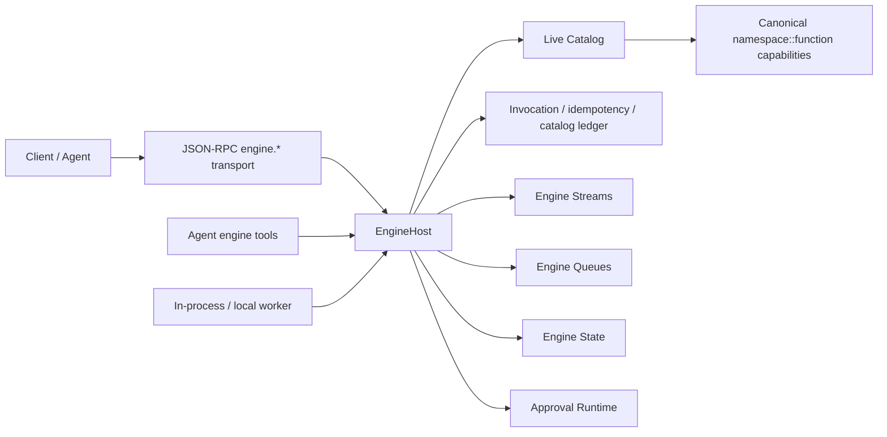

# Tron-native live capability fabric

Status: current architecture for `codex/iii-engine-redesign-exploration`.

Date: 2026-05-07.

## Thesis

Tron now treats the server as a live capability fabric. The executable surface is
the canonical engine catalog: `namespace::function` capabilities owned by live
workers, invoked by triggers, and recorded through the engine ledger.

JSON-RPC is not a domain API. It is a thin transport for five reserved engine
meta-capabilities:

- `engine.discover`
- `engine.inspect`
- `engine.watch`
- `engine.invoke`
- `engine.promote`

Dotted domain calls are not registered public methods on this branch. Clients
and agents discover canonical ids and invoke them through `engine.invoke`.

Inside the server, JSON-RPC is translated into a protocol-neutral
`EngineTransportRequest` before trigger dispatch. That envelope carries the
target function, trigger, actor, authority, trace, scope, payload, expected
revision, and explicit idempotency key. A future custom engine WebSocket
protocol should build the same envelope rather than introducing a second
domain path.

## First Principles

- The catalog is always live. A model call should see the current capabilities
  visible to its actor, session, and workspace.
- Live does not mean globally visible. Session-scoped and hidden/internal
  functions stay scoped until explicitly promoted.
- Functions are the modular unit of behavior. They are self-contained,
  schema-bearing, authority-checked, directly testable, and swappable by worker
  ownership.
- Triggers are causal rules. They carry actor, authority, trace, delivery mode,
  idempotency, parent invocation, and target revision into the engine.
- Mutating effects require explicit idempotency from engine-native callers.
  JSON-RPC request ids are correlation ids only.
- High-risk autonomous actions are approval-gated. Approval resolution resumes
  the original invocation context rather than starting a new unrelated command.
- Event store rows remain durable session truth. Engine streams provide live,
  resumable delivery and correlation; state is a projection/cache primitive.
- Every action must be explainable from the ledger: actor, grant, scopes, trace,
  parent, trigger, function revision, catalog revision, idempotency, leases,
  compensation status, result/error, and replay source.

## Current Shape

The code layout follows the same boundary:

- `packages/agent/src/engine/`: generic engine primitives.
- `packages/agent/src/server/capabilities/`: Tron domain capability handlers
  and canonical specs.
- `packages/agent/src/server/services/`: reusable server-local services used by
  capabilities.
- `packages/agent/src/server/transport/json_rpc/`: JSON-RPC framing, registry,
  validation, and the five `engine.*` transport methods.
- `packages/agent/src/server/transport/engine.rs`: protocol-neutral transport
  envelope used by JSON-RPC and intended for future engine-native protocols.
- `packages/agent/src/server/websocket/`: WebSocket delivery over engine stream
  records.

## Single-Shape Invariants

- Public JSON-RPC registry contains exactly five `engine.*` methods.
- No executable or discoverable noncanonical transport namespace exists.
- Domain dotted names are internal operation keys only, not public transport.
- Production code does not implement method-specific canonical capability functions.
- Production engine functions do not call handler-shaped transport shims.
- The live catalog is the source for agents, model tool schemas, triggers, and
  transport invocation.
- Missing engine, stream, queue, approval, idempotency, or lease services fail
  closed with structured errors and ledger records.

## Agent-Native Semantics

Agents receive stable meta-tools for discovery, inspection, watch, and
invocation. The underlying catalog can change between model calls. A newly
registered capability appears on the next live catalog projection if it is
visible, healthy, schema-bearing, and authorized for the actor.

Agent-created capabilities default to session visibility. Promotion to
workspace or system visibility goes through `engine.promote`, requires expected
function revision and explicit idempotency, and records an auditable catalog
change.

High-risk capabilities are discoverable with their effect, authority, approval,
lease, and compensation metadata. Autonomous invocation returns structured
approval-required state until a user/system-authorized actor resolves it.

## Verification Focus

Current guardrails should keep proving:

- the public transport method count is 5;
- removed dotted method calls return `METHOD_NOT_FOUND`;
- discovery returns canonical ids only;
- hidden/internal functions are not discoverable to normal agents;
- mutating canonical functions require schema, authority, explicit
  idempotency, risk metadata, approval metadata when required, leases when
  shared resources are touched, and compensation notes for high-risk effects;
- stream, queue, approval, tool, MCP, cron, external-worker, and runtime paths
  preserve causality through the engine ledger.
