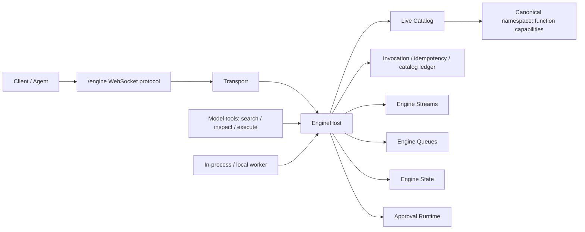

# Tron-native live capability fabric

Status: current architecture for `codex/iii-engine-redesign-exploration`.

Date: 2026-05-07.

## Thesis

Tron now treats the server as a live capability fabric. The executable surface is
the canonical engine catalog: `namespace::function` capabilities owned by live
workers, invoked by triggers, and recorded through the engine ledger.

The `/engine` WebSocket protocol is the public client capability protocol. It
is transport only; executable behavior lives behind canonical functions.

The request set is `hello`, `discover`, `inspect`, `watch`, `invoke`,
`promote`, `subscribe`, `poll`, `ack`, `heartbeat`, and `goodbye`.

All `/engine` messages are translated into the same protocol-neutral
`EngineTransportRequest` before trigger dispatch. That envelope carries the
target function, trigger, actor, authority, trace, scope, payload, expected
revision, and explicit idempotency key.

## First Principles

- The catalog is always live. A model call should see the current capabilities
  visible to its actor, session, and workspace.
- Live does not mean globally visible. Session-scoped and hidden/internal
  functions stay scoped until explicitly promoted.
- Functions are the modular unit of behavior. They are self-contained,
  schema-bearing, authority-checked, directly testable, and swappable by worker
  ownership.
- Triggers are causal rules. They carry actor, authority, trace, delivery mode,
  idempotency, parent invocation, and target revision into the engine.
- Mutating effects require explicit idempotency. Message ids are correlation
  ids only.
- High-risk autonomous actions are approval-gated. Approval resolution resumes
  the original invocation context rather than starting a new unrelated command.
- Event store rows remain durable session truth. Engine streams provide live,
  resumable delivery and correlation; state is a projection/cache primitive.
- Every action must be explainable from the ledger: actor, grant, scopes, trace,
  parent, trigger, function revision, catalog revision, idempotency, leases,
  compensation status, result/error, and replay source.

## Current Shape

The code layout follows the same boundary:

- `packages/agent/src/engine/`: generic engine fabric and primitive workers.
- `packages/agent/src/domains/`: Tron workers; each domain owns contracts,
  deps, handlers, operations, services, stream publishers, and tests.
- `packages/agent/src/transport/engine_ws.rs`: `/engine` WebSocket protocol
  parsing, heartbeat, stream subscribe/poll/ack, and envelope construction.
- `packages/agent/src/transport/engine.rs`: protocol-neutral transport envelope
  used by `/engine`.
- `packages/agent/src/transport/runtime/streams/`: runtime projection into
  engine stream records.
- `packages/agent/src/app/`: bootstrap, health, metrics, onboarding, and
  server shell.

## Single-Shape Invariants

- Public `/engine` clients cannot invoke dotted names or hidden/internal
  functions.
- No executable or discoverable noncanonical transport namespace exists.
- Domain dotted names are internal operation keys only, not public transport.
- Production code does not implement method-specific canonical capability functions.
- Production engine functions do not call handler-shaped transport shims.
- The live catalog is the source for agents, model tool schemas, triggers, and
  transport invocation.
- Missing engine, stream, queue, approval, idempotency, or lease services fail
  closed with structured errors and ledger records.

## Agent-Native Semantics

Agents receive exactly three stable model-facing primitives: `search`,
`inspect`, and `execute`. The underlying catalog can change between model
calls. A newly registered capability appears in `search` once it is visible,
healthy, schema-bearing, and authorized for the actor; it does not require a
prompt or provider-schema rewrite. The `/engine` discover/inspect/watch/invoke
messages remain the worker/client transport protocol and are not exposed as
model tools.

`search` projects live catalog functions as capability contracts and concrete
implementations. `inspect` returns the full current contract, selected
implementation, authority, risk, schema digest, and expected revision.
`execute` delegates through the engine ledger to the selected function.
The projection is owned by `capability::registry`: it builds revisioned
`CapabilityRegistrySnapshot`s from the live catalog, emits typed contract /
implementation / binding records, and ranks search results with local lexical
matching plus local `fastembed` embeddings stored in an embedded `sqlite-vec`
`vec0` index. If embeddings or vector indexing are unavailable, `search`
returns lexical results with an explicit degraded index status.

The same registry renders `capabilities.primer` after active rules and before
skill context. The default profile policy includes trusted first-party core
capabilities only; all-visible compact context is opt-in and budgeted.

Agent-created capabilities default to session visibility. Promotion to
workspace or system visibility goes through `/engine` `promote`, requires
expected function revision and explicit idempotency, and records an auditable
catalog change.

High-risk capabilities are discoverable with their effect, authority, approval,
lease, and compensation metadata. Autonomous invocation returns structured
approval-required state until a user/system-authorized actor resolves it.

## Verification Focus

Current guardrails should keep proving:

- the public transport method count is 5;
- removed dotted method calls return `METHOD_NOT_FOUND`;
- discovery returns canonical ids only;
- hidden/internal functions are not discoverable to normal agents;
- mutating canonical functions require schema, authority, explicit
  idempotency, risk metadata, approval metadata when required, leases when
  shared resources are touched, and compensation notes for high-risk effects;
- stream, queue, approval, cron, external-worker, runtime, and MCP-derived
  capability paths preserve causality through the engine ledger.
